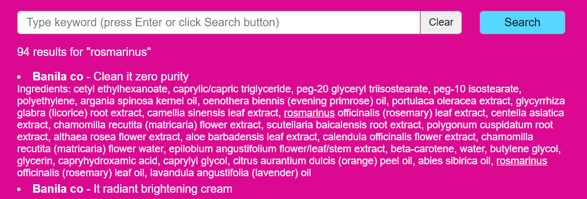

# Interview Challenge for Jolimoi
- Link to app: https://dev-julia.com/jolimoi/
- Author: [Julia Nguyen](https://dev-julia.com/)
- Subject: [Jolimoi front dev challenge](https://github.com/Jolimoi/front-dev-challenge)
- Description: This application is a simple proof-of-concept for a beauty shop which wants to give the users the ability to find specific products. 

## Philosophy
I wanted to keep the application as simple as possible to maintain the readability of the code. Neither CSS framework nor JS external libraries were needed.
Although the specifications were straightforward, I added some functionalities which could give some nice ideas for our client.

## Front-end stack
- Vue.js
- SCSS
- Axios

## App structure (src folder)
    .
    ├── ...
    ├── components                    
    │   ├── search   
    |   |   ├── SearchForm.vue
    |   |   ├── SearchInput.vue
    |   |   └── SearchResults.vue
    |   ├── Header.vue
    |   └── Loader.vue       
    ├── scss
    |   ├── abstract
    |   ├── base
    |   ├── components
    |   └── app.scss
    ├── services
    |   ├── filters.js
    |   └── network.js
    ├── App.vue
    └── main.js

## Functionalities
### Basic search


The core functionality of this application is the search. The user has to type keyword(s) and validate his search by pressing "Enter" or clicking on the "Search" button. A "Clear" button has been added, it will allow the user to erase his keywords.

Upon submission, products from the [Skin care API](https://skincare-api.herokuapp.com/) will be shown. In order to retrieve the relevant products, the singular route `GET /product` was used.

#### CORS issue
Because of CORS issue, a proxy was needed to allow requests from our application to the Skin care API. There are several ways to fix this issue:
- Install a browser extension. CON: will only be available on my computer
- Setup a dev proxy in `vue.config.js` file. CON: only works in development
- Use [cors-anywhere](https://github.com/Rob--W/cors-anywhere/) proxy.  PRO: works both in development and production. CON: can cause some latency.

**Chosen solution**: I used a dev proxy in development mode and the cors-anywhere proxy in production with environment variables. Sometimes the cors-anywhere proxy is not available or slow in [production](https://dev-julia.com/jolimoi/), if you encounter any network issue, please install this application on your computer and execute `npm run serve`.

### Search results
According to the requirement, search results are shown as a list. 

A very simple loader has been added so that the user get feedbacks.

The total number of results was added. The typed keywords are highlighted in the search results.


Because the API also includes product's ingredients in the query, I decided to display the ingredient list. The user needs to click on the product name to display the ingredient list.


### Not implemented: pagination
According to the [API documentation](https://github.com/LauraRobertson/skincareAPI#query-pagination), pagination params are available but it does not seem to work.
I was thinking of implementing a client side pagination but didn't do it because it won't make the API calls faster and won't give a better user experience as the content of one product is very light (brand and name).

### Not implemented: advanced search
By getting the list of ingredients (`GET /ingredients`), we can offer an advanced search for the client. The user would then be able to select the ingredients contained in the product. I didn't implement it because:
1. It would considerably change the POC's simplicity 
2. I think it is more relevant to allow the user to **exclude** specific ingredients like silicon or paraben and the API doesn't offer an easy way to achieve that.

## Project setup
```
npm install
```

### Compiles and hot-reloads for development
```
npm run serve
```

### Compiles and minifies for production
```
npm run build
```

### Lints and fixes files
```
npm run lint
```
